# Occupie Architecture and Data Flow

**Document Version:** 1.0  
**Last Updated:** October 10, 2026  
**Status:** Complete System Architecture Documentation

---

## Table of Contents

1. [System Architecture Overview](#1-system-architecture-overview)
2. [Frontend-to-Backend Request Flow](#2-frontend-to-backend-request-flow)
3. [Authentication Sequence](#3-authentication-sequence)
4. [Customer Reservation Flow](#4-customer-reservation-flow)
5. [Host Seating Workflow](#5-host-seating-workflow)
6. [Database Entity Relationships](#6-database-entity-relationships)
7. [Role Permission Matrix](#7-role-permission-matrix)
8. [State Transition Diagrams](#8-state-transition-diagrams)
9. [Deployment Architecture](#9-deployment-architecture)

---

## 1. System Architecture Overview

### High-Level Architecture

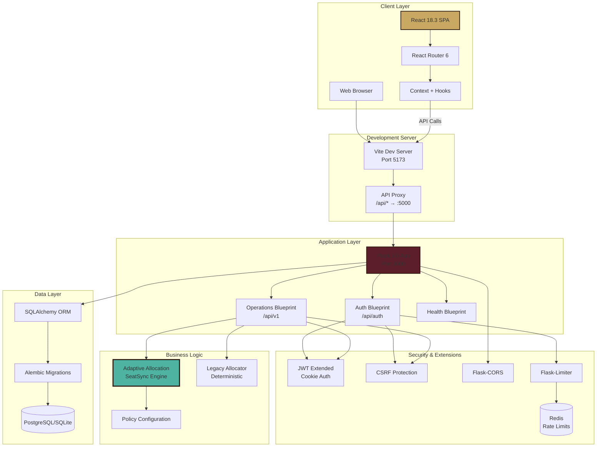
```mermaid
graph TB
    subgraph "Client Layer"
        Browser[Web Browser]
        ReactApp[React 18.3 SPA]
        Router[React Router 6]
        State[Context + Hooks]
    end
    
    subgraph "Development Server"
        Vite[Vite Dev Server<br/>Port 5173]
        Proxy[API Proxy<br/>/api/* → :5000]
    end
    
    subgraph "Application Layer"
        Flask[Flask 3.0 App<br/>Port 5000]
        Auth[Auth Blueprint<br/>/api/auth]
        Ops[Operations Blueprint<br/>/api/v1]
        Health[Health Blueprint]
    end
    
    subgraph "Business Logic"
        Allocation[Adaptive Allocation<br/>SeatSync Engine]
        LegacyAlloc[Legacy Allocator<br/>Deterministic]
        Policy[Policy Configuration]
    end
    
    subgraph "Data Layer"
        ORM[SQLAlchemy ORM]
        Migrations[Alembic Migrations]
        DB[(PostgreSQL/SQLite)]
    end
    
    subgraph "Security & Extensions"
        JWT[JWT Extended<br/>Cookie Auth]
        CSRF[CSRF Protection]
        CORS[Flask-CORS]
        RateLimit[Flask-Limiter]
        Redis[(Redis<br/>Rate Limits)]
    end
    
    Browser --> Vite
    Vite --> Proxy
    Proxy --> Flask
    
    ReactApp --> Router
    Router --> State
    State -->|API Calls| Vite
    
    Flask --> Auth
    Flask --> Ops
    Flask --> Health
    
    Auth --> JWT
    Auth --> CSRF
    Auth --> RateLimit
    
    Ops --> JWT
    Ops --> CSRF
    Ops --> Allocation
    Ops --> LegacyAlloc
    
    Allocation --> Policy
    
    Flask --> CORS
    Flask --> ORM
    ORM --> Migrations
    Migrations --> DB
    
    RateLimit --> Redis
    
    style Allocation fill:#4fb3a1,stroke:#2c1810,stroke-width:3px
    style Flask fill:#5c1f2a,stroke:#2c1810,stroke-width:2px
    style ReactApp fill:#c9a961,stroke:#2c1810,stroke-width:2px
```

### Technology Stack Diagram

```mermaid
graph LR
    subgraph "Frontend Stack"
        React[React 18.3.1]
        ReactRouter[React Router 6.28]
        Tailwind[TailwindCSS 3.4]
        FramerMotion[Framer Motion 11.11]
        GSAP[GSAP 3.15]
        Lucide[Lucide Icons]
        Recharts[Recharts 2.13]
    end
    
    subgraph "Build Tools"
        Vite[Vite 5.4.11]
        PostCSS[PostCSS]
        Vitest[Vitest 2.1]
    end
    
    subgraph "Backend Stack"
        Python[Python 3.13]
        Flask[Flask 3.0]
        SQLAlchemy[SQLAlchemy 3.1]
        JWTExt[JWT-Extended 4.5]
        Limiter[Flask-Limiter 3.8]
        FlaskCORS[Flask-CORS 4.0]
    end
    
    subgraph "Database"
        PostgreSQL[PostgreSQL 14+]
        SQLite[SQLite 3]
        Alembic[Alembic/Flask-Migrate]
    end
    
    subgraph "Testing"
        Pytest[Pytest 8.0]
        TestingLib[@testing-library/react]
    end
    
    React --> Vite
    Tailwind --> PostCSS
    PostCSS --> Vite
    
    Flask --> Python
    SQLAlchemy --> Flask
    JWTExt --> Flask
    
    PostgreSQL --> SQLAlchemy
    SQLite --> SQLAlchemy
    Alembic --> SQLAlchemy
```

---

## 2. Frontend-to-Backend Request Flow

### API Request Lifecycle

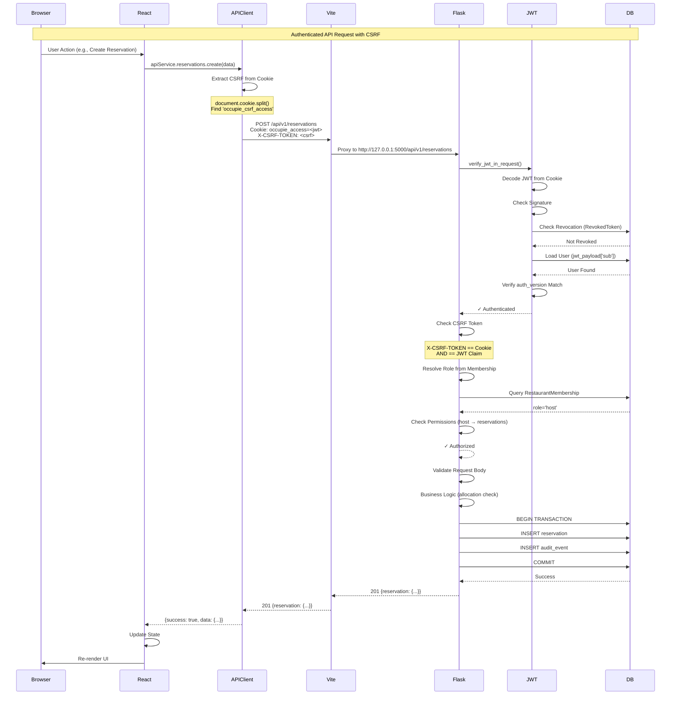
```mermaid
sequenceDiagram
    participant Browser
    participant React
    participant APIClient
    participant Vite
    participant Flask
    participant JWT
    participant DB
    
    Note over Browser,DB: Authenticated API Request with CSRF
    
    Browser->>React: User Action (e.g., Create Reservation)
    React->>APIClient: apiService.reservations.create(data)
    
    APIClient->>APIClient: Extract CSRF from Cookie
    Note over APIClient: document.cookie.split()<br/>Find 'occupie_csrf_access'
    
    APIClient->>Vite: POST /api/v1/reservations<br/>Cookie: occupie_access=<jwt><br/>X-CSRF-TOKEN: <csrf>
    
    Vite->>Flask: Proxy to http://127.0.0.1:5000/api/v1/reservations
    
    Flask->>JWT: verify_jwt_in_request()
    JWT->>JWT: Decode JWT from Cookie
    JWT->>JWT: Check Signature
    JWT->>DB: Check Revocation (RevokedToken)
    DB-->>JWT: Not Revoked
    JWT->>DB: Load User (jwt_payload['sub'])
    DB-->>JWT: User Found
    JWT->>JWT: Verify auth_version Match
    JWT-->>Flask: ✓ Authenticated
    
    Flask->>Flask: Check CSRF Token
    Note over Flask: X-CSRF-TOKEN == Cookie<br/>AND == JWT Claim
    
    Flask->>Flask: Resolve Role from Membership
    Flask->>DB: Query RestaurantMembership
    DB-->>Flask: role='host'
    
    Flask->>Flask: Check Permissions (host → reservations)
    Flask-->>Flask: ✓ Authorized
    
    Flask->>Flask: Validate Request Body
    Flask->>Flask: Business Logic (allocation check)
    Flask->>DB: BEGIN TRANSACTION
    Flask->>DB: INSERT reservation
    Flask->>DB: INSERT audit_event
    Flask->>DB: COMMIT
    DB-->>Flask: Success
    
    Flask-->>Vite: 201 {reservation: {...}}
    Vite-->>APIClient: 201 {reservation: {...}}
    APIClient-->>React: {success: true, data: {...}}
    React->>React: Update State
    React->>Browser: Re-render UI
```

### Error Handling Flow

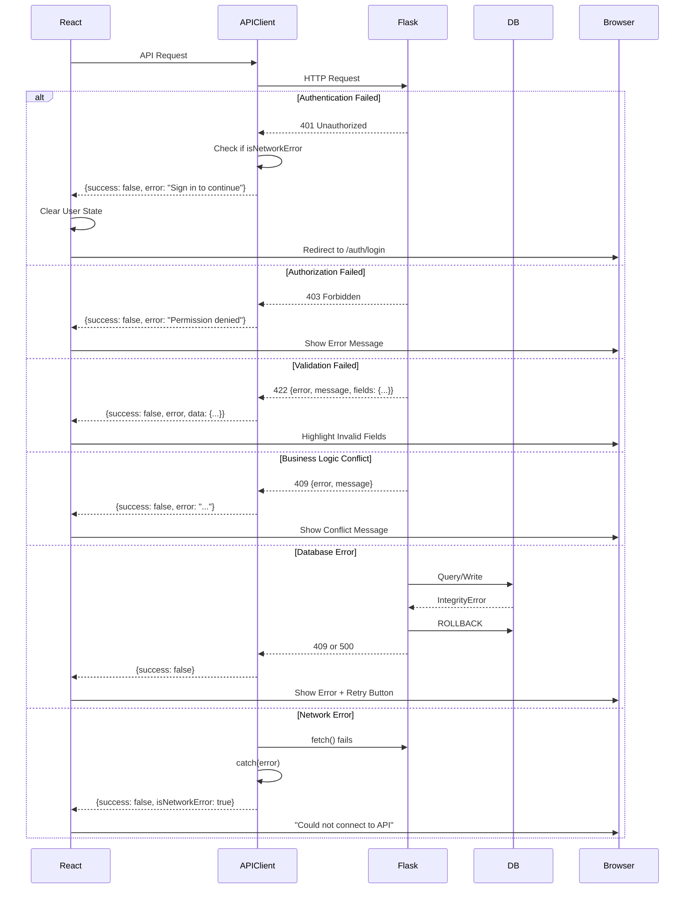
```mermaid
sequenceDiagram
    participant React
    participant APIClient
    participant Flask
    participant DB
    
    React->>APIClient: API Request
    APIClient->>Flask: HTTP Request
    
    alt Authentication Failed
        Flask-->>APIClient: 401 Unauthorized
        APIClient->>APIClient: Check if isNetworkError
        APIClient-->>React: {success: false, error: "Sign in to continue"}
        React->>React: Clear User State
        React->>Browser: Redirect to /auth/login
    
    else Authorization Failed
        Flask-->>APIClient: 403 Forbidden
        APIClient-->>React: {success: false, error: "Permission denied"}
        React->>Browser: Show Error Message
    
    else Validation Failed
        Flask-->>APIClient: 422 {error, message, fields: {...}}
        APIClient-->>React: {success: false, error, data: {...}}
        React->>Browser: Highlight Invalid Fields
    
    else Business Logic Conflict
        Flask-->>APIClient: 409 {error, message}
        APIClient-->>React: {success: false, error: "..."}
        React->>Browser: Show Conflict Message
    
    else Database Error
        Flask->>DB: Query/Write
        DB-->>Flask: IntegrityError
        Flask->>DB: ROLLBACK
        Flask-->>APIClient: 409 or 500
        APIClient-->>React: {success: false}
        React->>Browser: Show Error + Retry Button
    
    else Network Error
        APIClient->>Flask: fetch() fails
        APIClient->>APIClient: catch(error)
        APIClient-->>React: {success: false, isNetworkError: true}
        React->>Browser: "Could not connect to API"
    end
```

---

## 3. Authentication Sequence

### Registration Flow

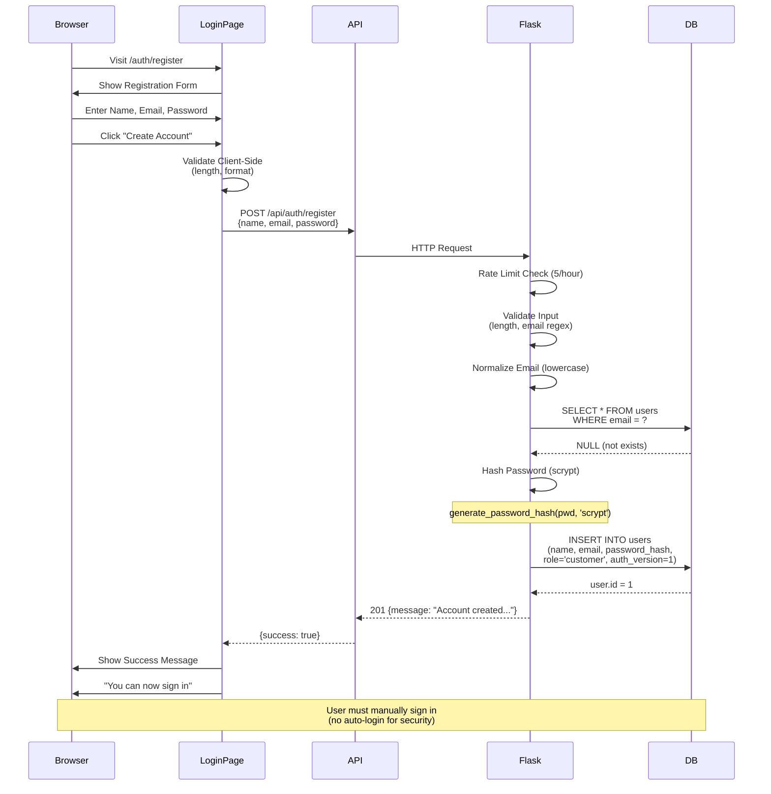
```mermaid
sequenceDiagram
    participant Browser
    participant LoginPage
    participant API
    participant Flask
    participant DB
    
    Browser->>LoginPage: Visit /auth/register
    LoginPage->>Browser: Show Registration Form
    
    Browser->>LoginPage: Enter Name, Email, Password
    Browser->>LoginPage: Click "Create Account"
    
    LoginPage->>LoginPage: Validate Client-Side<br/>(length, format)
    
    LoginPage->>API: POST /api/auth/register<br/>{name, email, password}
    
    API->>Flask: HTTP Request
    
    Flask->>Flask: Rate Limit Check (5/hour)
    Flask->>Flask: Validate Input<br/>(length, email regex)
    Flask->>Flask: Normalize Email (lowercase)
    
    Flask->>DB: SELECT * FROM users<br/>WHERE email = ?
    DB-->>Flask: NULL (not exists)
    
    Flask->>Flask: Hash Password (scrypt)
    Note over Flask: generate_password_hash(pwd, 'scrypt')
    
    Flask->>DB: INSERT INTO users<br/>(name, email, password_hash,<br/>role='customer', auth_version=1)
    DB-->>Flask: user.id = 1
    
    Flask-->>API: 201 {message: "Account created..."}
    API-->>LoginPage: {success: true}
    
    LoginPage->>Browser: Show Success Message
    LoginPage->>Browser: "You can now sign in"
    
    Note over Browser,DB: User must manually sign in<br/>(no auto-login for security)
```

### Login and Session Creation

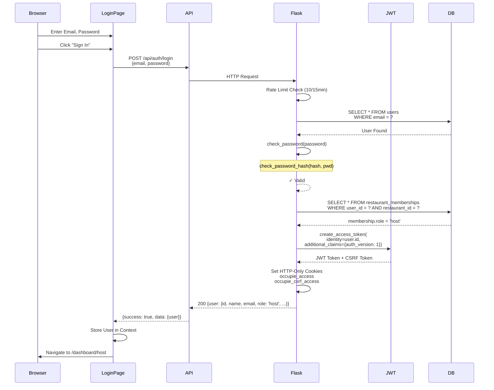
```mermaid
sequenceDiagram
    participant Browser
    participant LoginPage
    participant API
    participant Flask
    participant JWT
    participant DB
    
    Browser->>LoginPage: Enter Email, Password
    Browser->>LoginPage: Click "Sign In"
    
    LoginPage->>API: POST /api/auth/login<br/>{email, password}
    
    API->>Flask: HTTP Request
    
    Flask->>Flask: Rate Limit Check (10/15min)
    
    Flask->>DB: SELECT * FROM users<br/>WHERE email = ?
    DB-->>Flask: User Found
    
    Flask->>Flask: check_password(password)
    Note over Flask: check_password_hash(hash, pwd)
    Flask-->>Flask: ✓ Valid
    
    Flask->>DB: SELECT * FROM restaurant_memberships<br/>WHERE user_id = ? AND restaurant_id = ?
    DB-->>Flask: membership.role = 'host'
    
    Flask->>JWT: create_access_token(<br/>identity=user.id,<br/>additional_claims={auth_version: 1})
    JWT-->>Flask: JWT Token + CSRF Token
    
    Flask->>Flask: Set HTTP-Only Cookies<br/>occupie_access<br/>occupie_csrf_access
    
    Flask-->>API: 200 {user: {id, name, email, role: 'host', ...}}
    API-->>LoginPage: {success: true, data: {user}}
    
    LoginPage->>LoginPage: Store User in Context
    LoginPage->>Browser: Navigate to /dashboard/host
```

### Session Restoration (Page Reload)

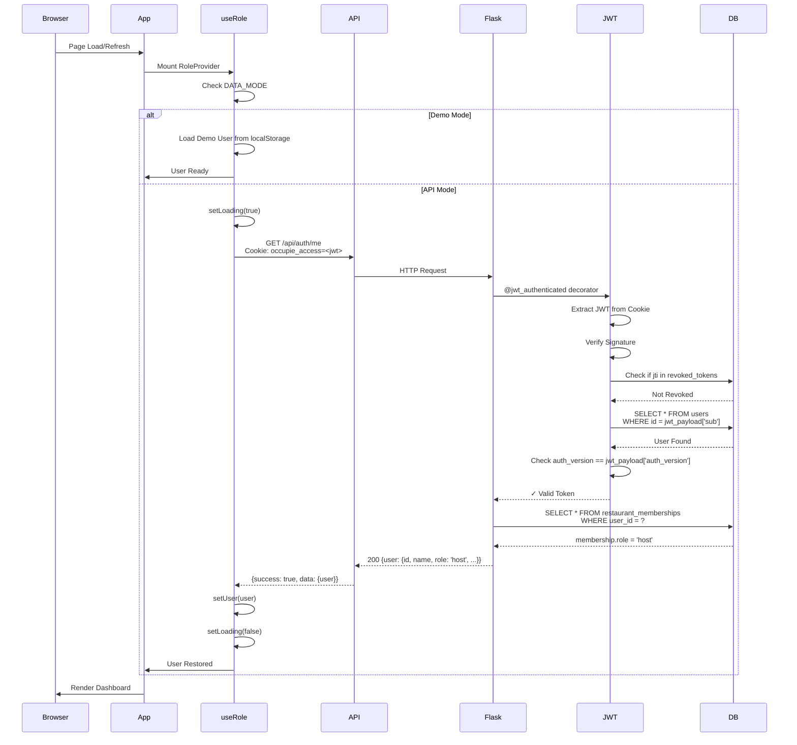
```mermaid
sequenceDiagram
    participant Browser
    participant App
    participant useRole
    participant API
    participant Flask
    participant JWT
    participant DB
    
    Browser->>App: Page Load/Refresh
    App->>useRole: Mount RoleProvider
    
    useRole->>useRole: Check DATA_MODE
    
    alt Demo Mode
        useRole->>useRole: Load Demo User from localStorage
        useRole->>App: User Ready
    else API Mode
        useRole->>useRole: setLoading(true)
        useRole->>API: GET /api/auth/me<br/>Cookie: occupie_access=<jwt>
        
        API->>Flask: HTTP Request
        Flask->>JWT: @jwt_authenticated decorator
        JWT->>JWT: Extract JWT from Cookie
        JWT->>JWT: Verify Signature
        JWT->>DB: Check if jti in revoked_tokens
        DB-->>JWT: Not Revoked
        
        JWT->>DB: SELECT * FROM users<br/>WHERE id = jwt_payload['sub']
        DB-->>JWT: User Found
        
        JWT->>JWT: Check auth_version == jwt_payload['auth_version']
        JWT-->>Flask: ✓ Valid Token
        
        Flask->>DB: SELECT * FROM restaurant_memberships<br/>WHERE user_id = ?
        DB-->>Flask: membership.role = 'host'
        
        Flask-->>API: 200 {user: {id, name, role: 'host', ...}}
        API-->>useRole: {success: true, data: {user}}
        
        useRole->>useRole: setUser(user)
        useRole->>useRole: setLoading(false)
        useRole->>App: User Restored
    end
    
    App->>Browser: Render Dashboard
```

### Logout Flow

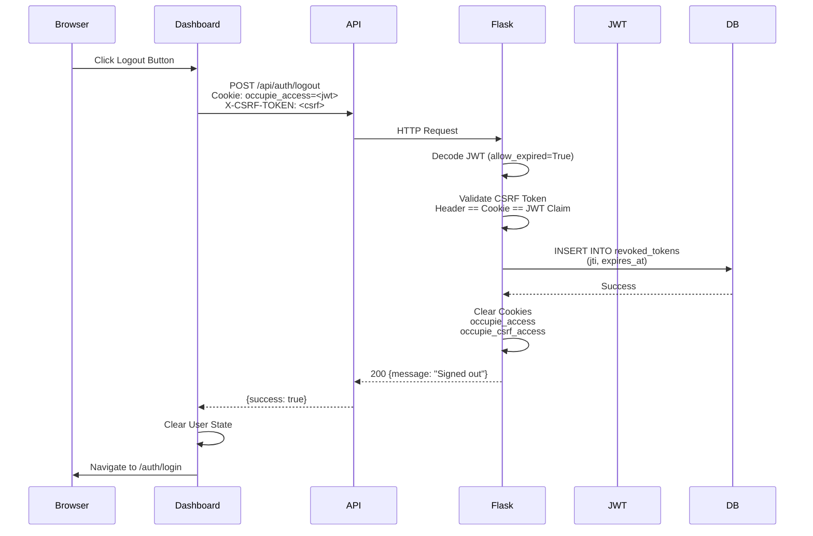
```mermaid
sequenceDiagram
    participant Browser
    participant Dashboard
    participant API
    participant Flask
    participant JWT
    participant DB
    
    Browser->>Dashboard: Click Logout Button
    
    Dashboard->>API: POST /api/auth/logout<br/>Cookie: occupie_access=<jwt><br/>X-CSRF-TOKEN: <csrf>
    
    API->>Flask: HTTP Request
    
    Flask->>Flask: Decode JWT (allow_expired=True)
    Flask->>Flask: Validate CSRF Token<br/>Header == Cookie == JWT Claim
    
    Flask->>DB: INSERT INTO revoked_tokens<br/>(jti, expires_at)
    DB-->>Flask: Success
    
    Flask->>Flask: Clear Cookies<br/>occupie_access<br/>occupie_csrf_access
    
    Flask-->>API: 200 {message: "Signed out"}
    API-->>Dashboard: {success: true}
    
    Dashboard->>Dashboard: Clear User State
    Dashboard->>Browser: Navigate to /auth/login
```

---

## 4. Customer Reservation Flow

### Complete Booking Sequence

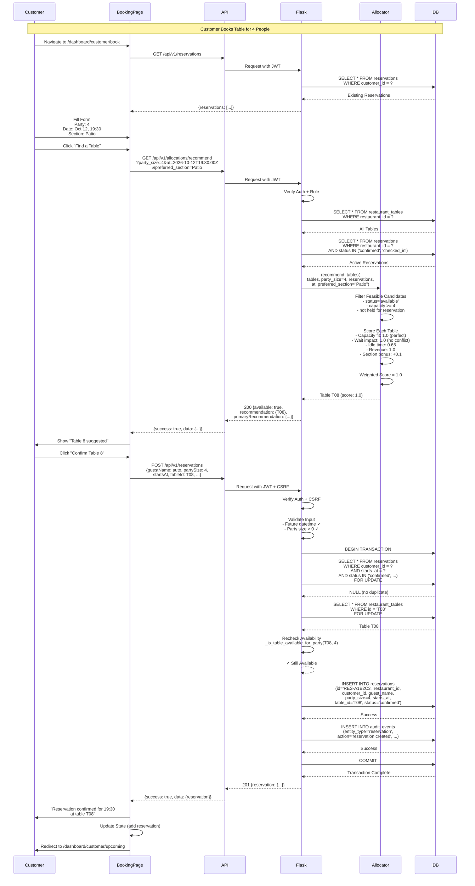
```mermaid
sequenceDiagram
    participant Customer
    participant BookingPage
    participant API
    participant Flask
    participant Allocator
    participant DB
    
    Note over Customer,DB: Customer Books Table for 4 People
    
    Customer->>BookingPage: Navigate to /dashboard/customer/book
    BookingPage->>API: GET /api/v1/reservations
    API->>Flask: Request with JWT
    Flask->>DB: SELECT * FROM reservations<br/>WHERE customer_id = ?
    DB-->>Flask: Existing Reservations
    Flask-->>BookingPage: {reservations: [...]}
    
    Customer->>BookingPage: Fill Form<br/>Party: 4<br/>Date: Oct 12, 19:30<br/>Section: Patio
    Customer->>BookingPage: Click "Find a Table"
    
    BookingPage->>API: GET /api/v1/allocations/recommend<br/>?party_size=4&at=2026-10-12T19:30:00Z<br/>&preferred_section=Patio
    
    API->>Flask: Request with JWT
    Flask->>Flask: Verify Auth + Role
    Flask->>DB: SELECT * FROM restaurant_tables<br/>WHERE restaurant_id = ?
    DB-->>Flask: All Tables
    
    Flask->>DB: SELECT * FROM reservations<br/>WHERE restaurant_id = ?<br/>AND status IN ('confirmed', 'checked_in')
    DB-->>Flask: Active Reservations
    
    Flask->>Allocator: recommend_tables(<br/>tables, party_size=4, reservations,<br/>at, preferred_section="Patio")
    
    Allocator->>Allocator: Filter Feasible Candidates<br/>- status='available'<br/>- capacity >= 4<br/>- not held for reservation
    
    Allocator->>Allocator: Score Each Table<br/>- Capacity fit: 1.0 (perfect)<br/>- Wait impact: 1.0 (no conflict)<br/>- Idle time: 0.65<br/>- Revenue: 1.0<br/>- Section bonus: +0.1
    
    Allocator->>Allocator: Weighted Score = 1.0
    Allocator-->>Flask: Table T08 (score: 1.0)
    
    Flask-->>API: 200 {available: true,<br/>recommendation: {T08},<br/>primaryRecommendation: {...}}
    
    API-->>BookingPage: {success: true, data: {...}}
    BookingPage->>Customer: Show "Table 8 suggested"
    
    Customer->>BookingPage: Click "Confirm Table 8"
    
    BookingPage->>API: POST /api/v1/reservations<br/>{guestName: auto, partySize: 4,<br/>startsAt, tableId: T08, ...}
    
    API->>Flask: Request with JWT + CSRF
    Flask->>Flask: Verify Auth + CSRF
    Flask->>Flask: Validate Input<br/>- Future datetime ✓<br/>- Party size > 0 ✓
    
    Flask->>DB: BEGIN TRANSACTION
    Flask->>DB: SELECT * FROM reservations<br/>WHERE customer_id = ?<br/>AND starts_at = ?<br/>AND status IN ('confirmed', ...)<br/>FOR UPDATE
    DB-->>Flask: NULL (no duplicate)
    
    Flask->>DB: SELECT * FROM restaurant_tables<br/>WHERE id = 'T08'<br/>FOR UPDATE
    DB-->>Flask: Table T08
    
    Flask->>Flask: Recheck Availability<br/>_is_table_available_for_party(T08, 4)
    Flask-->>Flask: ✓ Still Available
    
    Flask->>DB: INSERT INTO reservations<br/>(id='RES-A1B2C3', restaurant_id,<br/>customer_id, guest_name,<br/>party_size=4, starts_at,<br/>table_id='T08', status='confirmed')
    DB-->>Flask: Success
    
    Flask->>DB: INSERT INTO audit_events<br/>(entity_type='reservation',<br/>action='reservation.created', ...)
    DB-->>Flask: Success
    
    Flask->>DB: COMMIT
    DB-->>Flask: Transaction Complete
    
    Flask-->>API: 201 {reservation: {...}}
    API-->>BookingPage: {success: true, data: {reservation}}
    
    BookingPage->>Customer: "Reservation confirmed for 19:30<br/>at table T08"
    BookingPage->>BookingPage: Update State (add reservation)
    BookingPage->>Customer: Redirect to /dashboard/customer/upcoming
```

### Check-In Flow

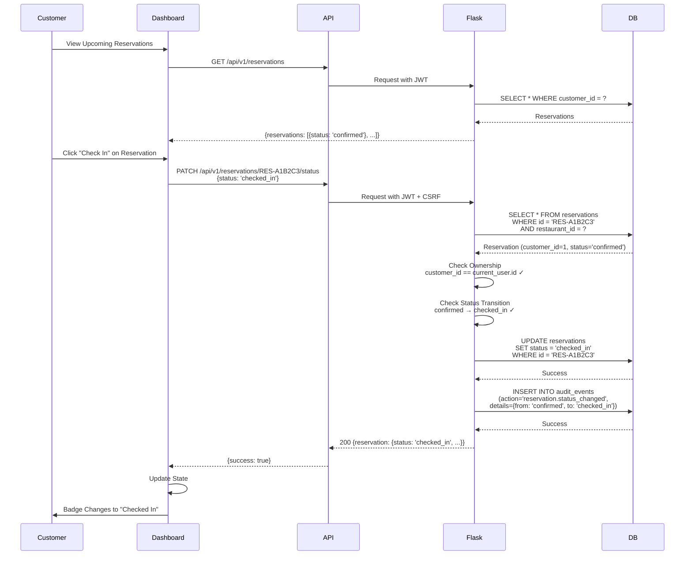
```mermaid
sequenceDiagram
    participant Customer
    participant Dashboard
    participant API
    participant Flask
    participant DB
    
    Customer->>Dashboard: View Upcoming Reservations
    Dashboard->>API: GET /api/v1/reservations
    API->>Flask: Request with JWT
    Flask->>DB: SELECT * WHERE customer_id = ?
    DB-->>Flask: Reservations
    Flask-->>Dashboard: {reservations: [{status: 'confirmed'}, ...]}
    
    Customer->>Dashboard: Click "Check In" on Reservation
    
    Dashboard->>API: PATCH /api/v1/reservations/RES-A1B2C3/status<br/>{status: 'checked_in'}
    
    API->>Flask: Request with JWT + CSRF
    Flask->>DB: SELECT * FROM reservations<br/>WHERE id = 'RES-A1B2C3'<br/>AND restaurant_id = ?
    DB-->>Flask: Reservation (customer_id=1, status='confirmed')
    
    Flask->>Flask: Check Ownership<br/>customer_id == current_user.id ✓
    Flask->>Flask: Check Status Transition<br/>confirmed → checked_in ✓
    
    Flask->>DB: UPDATE reservations<br/>SET status = 'checked_in'<br/>WHERE id = 'RES-A1B2C3'
    DB-->>Flask: Success
    
    Flask->>DB: INSERT INTO audit_events<br/>(action='reservation.status_changed',<br/>details={from: 'confirmed', to: 'checked_in'})
    DB-->>Flask: Success
    
    Flask-->>API: 200 {reservation: {status: 'checked_in', ...}}
    API-->>Dashboard: {success: true}
    
    Dashboard->>Dashboard: Update State
    Dashboard->>Customer: Badge Changes to "Checked In"
```

---

## 5. Host Seating Workflow

### Seat Walk-In from Waitlist

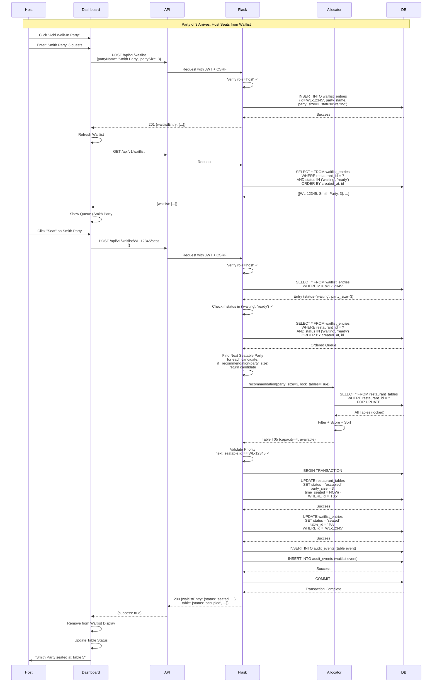
```mermaid
sequenceDiagram
    participant Host
    participant Dashboard
    participant API
    participant Flask
    participant Allocator
    participant DB
    
    Note over Host,DB: Party of 3 Arrives, Host Seats from Waitlist
    
    Host->>Dashboard: Click "Add Walk-In Party"
    Host->>Dashboard: Enter: Smith Party, 3 guests
    Dashboard->>API: POST /api/v1/waitlist<br/>{partyName: 'Smith Party', partySize: 3}
    
    API->>Flask: Request with JWT + CSRF
    Flask->>Flask: Verify role='host' ✓
    Flask->>DB: INSERT INTO waitlist_entries<br/>(id='WL-12345', party_name,<br/>party_size=3, status='waiting')
    DB-->>Flask: Success
    Flask-->>Dashboard: 201 {waitlistEntry: {...}}
    
    Dashboard->>Dashboard: Refresh Waitlist
    Dashboard->>API: GET /api/v1/waitlist
    API->>Flask: Request
    Flask->>DB: SELECT * FROM waitlist_entries<br/>WHERE restaurant_id = ?<br/>AND status IN ('waiting', 'ready')<br/>ORDER BY created_at, id
    DB-->>Flask: [{WL-12345, Smith Party, 3}, ...]
    Flask-->>Dashboard: {waitlist: [...]}
    
    Dashboard->>Dashboard: Show Queue (Smith Party #1)
    
    Host->>Dashboard: Click "Seat" on Smith Party
    
    Dashboard->>API: POST /api/v1/waitlist/WL-12345/seat<br/>{}
    
    API->>Flask: Request with JWT + CSRF
    Flask->>Flask: Verify role='host' ✓
    
    Flask->>DB: SELECT * FROM waitlist_entries<br/>WHERE id = 'WL-12345'
    DB-->>Flask: Entry (status='waiting', party_size=3)
    
    Flask->>Flask: Check if status in ('waiting', 'ready') ✓
    
    Flask->>DB: SELECT * FROM waitlist_entries<br/>WHERE restaurant_id = ?<br/>AND status IN ('waiting', 'ready')<br/>ORDER BY created_at, id
    DB-->>Flask: Ordered Queue
    
    Flask->>Flask: Find Next Seatable Party<br/>for each candidate:<br/>  if _recommendation(party_size)<br/>    return candidate
    
    Flask->>Allocator: _recommendation(party_size=3, lock_tables=True)
    Allocator->>DB: SELECT * FROM restaurant_tables<br/>WHERE restaurant_id = ?<br/>FOR UPDATE
    DB-->>Allocator: All Tables (locked)
    
    Allocator->>Allocator: Filter + Score + Sort
    Allocator-->>Flask: Table T05 (capacity=4, available)
    
    Flask->>Flask: Validate Priority<br/>next_seatable.id == WL-12345 ✓
    
    Flask->>DB: BEGIN TRANSACTION
    
    Flask->>DB: UPDATE restaurant_tables<br/>SET status = 'occupied',<br/>party_size = 3,<br/>time_seated = NOW()<br/>WHERE id = 'T05'
    DB-->>Flask: Success
    
    Flask->>DB: UPDATE waitlist_entries<br/>SET status = 'seated',<br/>table_id = 'T05'<br/>WHERE id = 'WL-12345'
    DB-->>Flask: Success
    
    Flask->>DB: INSERT INTO audit_events (table event)
    Flask->>DB: INSERT INTO audit_events (waitlist event)
    DB-->>Flask: Success
    
    Flask->>DB: COMMIT
    DB-->>Flask: Transaction Complete
    
    Flask-->>API: 200 {waitlistEntry: {status: 'seated', ...},<br/>table: {status: 'occupied', ...}}
    
    API-->>Dashboard: {success: true}
    Dashboard->>Dashboard: Remove from Waitlist Display
    Dashboard->>Dashboard: Update Table Status
    Dashboard->>Host: "Smith Party seated at Table 5"
```

### Seat Reservation

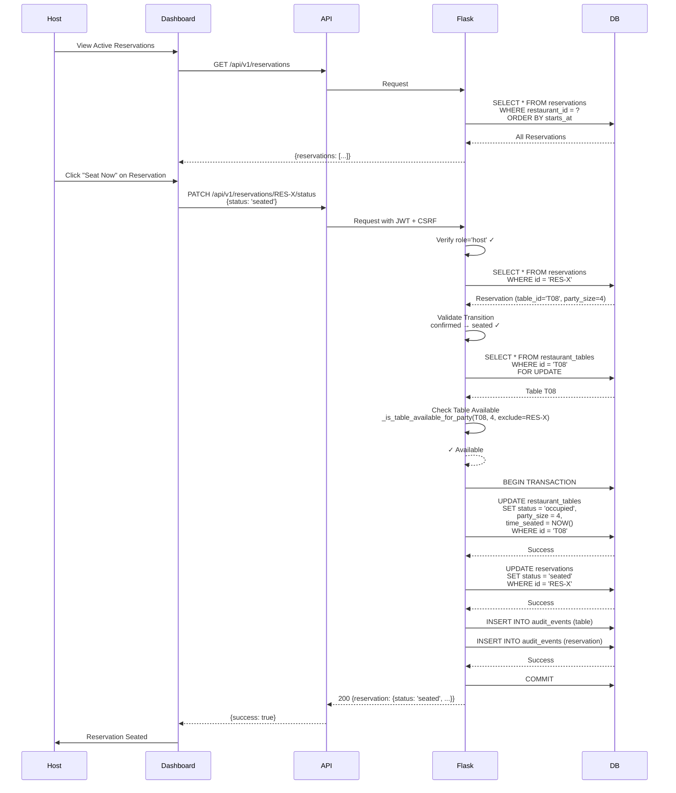
```mermaid
sequenceDiagram
    participant Host
    participant Dashboard
    participant API
    participant Flask
    participant DB
    
    Host->>Dashboard: View Active Reservations
    Dashboard->>API: GET /api/v1/reservations
    API->>Flask: Request
    Flask->>DB: SELECT * FROM reservations<br/>WHERE restaurant_id = ?<br/>ORDER BY starts_at
    DB-->>Flask: All Reservations
    Flask-->>Dashboard: {reservations: [...]}
    
    Host->>Dashboard: Click "Seat Now" on Reservation
    
    Dashboard->>API: PATCH /api/v1/reservations/RES-X/status<br/>{status: 'seated'}
    
    API->>Flask: Request with JWT + CSRF
    Flask->>Flask: Verify role='host' ✓
    
    Flask->>DB: SELECT * FROM reservations<br/>WHERE id = 'RES-X'
    DB-->>Flask: Reservation (table_id='T08', party_size=4)
    
    Flask->>Flask: Validate Transition<br/>confirmed → seated ✓
    
    Flask->>DB: SELECT * FROM restaurant_tables<br/>WHERE id = 'T08'<br/>FOR UPDATE
    DB-->>Flask: Table T08
    
    Flask->>Flask: Check Table Available<br/>_is_table_available_for_party(T08, 4, exclude=RES-X)
    Flask-->>Flask: ✓ Available
    
    Flask->>DB: BEGIN TRANSACTION
    
    Flask->>DB: UPDATE restaurant_tables<br/>SET status = 'occupied',<br/>party_size = 4,<br/>time_seated = NOW()<br/>WHERE id = 'T08'
    DB-->>Flask: Success
    
    Flask->>DB: UPDATE reservations<br/>SET status = 'seated'<br/>WHERE id = 'RES-X'
    DB-->>Flask: Success
    
    Flask->>DB: INSERT INTO audit_events (table)
    Flask->>DB: INSERT INTO audit_events (reservation)
    DB-->>Flask: Success
    
    Flask->>DB: COMMIT
    
    Flask-->>API: 200 {reservation: {status: 'seated', ...}}
    API-->>Dashboard: {success: true}
    Dashboard->>Host: Reservation Seated
```

---

## 6. Database Entity Relationships

### Complete ERD

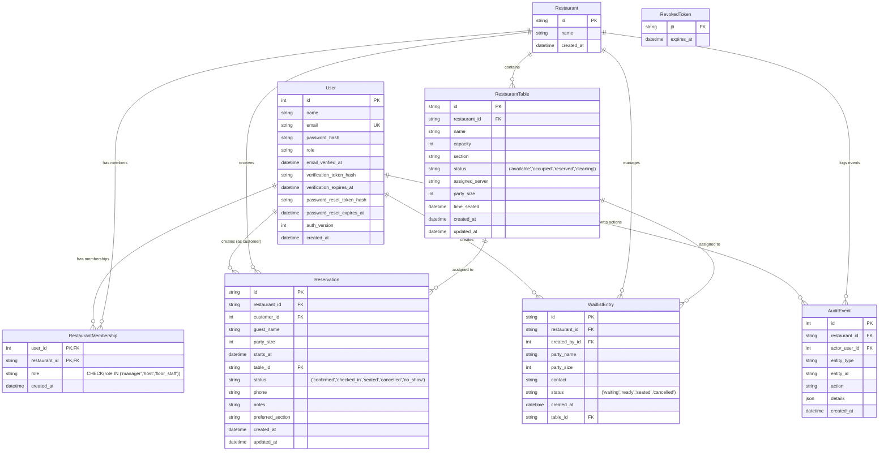
```mermaid
erDiagram
    User ||--o{ RestaurantMembership : "has memberships"
    User ||--o{ Reservation : "creates (as customer)"
    User ||--o{ WaitlistEntry : "creates"
    User ||--o{ AuditEvent : "performs actions"
    
    Restaurant ||--o{ RestaurantMembership : "has members"
    Restaurant ||--o{ RestaurantTable : "contains"
    Restaurant ||--o{ Reservation : "receives"
    Restaurant ||--o{ WaitlistEntry : "manages"
    Restaurant ||--o{ AuditEvent : "logs events"
    
    RestaurantTable ||--o{ Reservation : "assigned to"
    RestaurantTable ||--o{ WaitlistEntry : "assigned to"
    
    User {
        int id PK
        string name
        string email UK
        string password_hash
        string role
        datetime email_verified_at
        string verification_token_hash
        datetime verification_expires_at
        string password_reset_token_hash
        datetime password_reset_expires_at
        int auth_version
        datetime created_at
    }
    
    Restaurant {
        string id PK
        string name
        datetime created_at
    }
    
    RestaurantMembership {
        int user_id PK,FK
        string restaurant_id PK,FK
        string role "CHECK(role IN ('manager','host','floor_staff'))"
        datetime created_at
    }
    
    RestaurantTable {
        string id PK
        string restaurant_id FK
        string name
        int capacity
        string section
        string status "('available','occupied','reserved','cleaning')"
        string assigned_server
        int party_size
        datetime time_seated
        datetime created_at
        datetime updated_at
    }
    
    Reservation {
        string id PK
        string restaurant_id FK
        int customer_id FK
        string guest_name
        int party_size
        datetime starts_at
        string table_id FK
        string status "('confirmed','checked_in','seated','cancelled','no_show')"
        string phone
        string notes
        string preferred_section
        datetime created_at
        datetime updated_at
    }
    
    WaitlistEntry {
        string id PK
        string restaurant_id FK
        int created_by_id FK
        string party_name
        int party_size
        string contact
        string status "('waiting','ready','seated','cancelled')"
        datetime created_at
        string table_id FK
    }
    
    RevokedToken {
        string jti PK
        datetime expires_at
    }
    
    AuditEvent {
        int id PK
        string restaurant_id FK
        int actor_user_id FK
        string entity_type
        string entity_id
        string action
        json details
        datetime created_at
    }
```

### Key Relationships

1. **User ↔ RestaurantMembership ↔ Restaurant**
   - Many-to-many through junction table
   - User can be staff member at multiple restaurants
   - Restaurant has multiple staff members
   - Membership defines role (manager, host, floor_staff)

2. **Restaurant ↔ RestaurantTable**
   - One restaurant has many tables
   - Tables are tenant-scoped by restaurant_id

3. **RestaurantTable ↔ Reservation**
   - Table can have multiple reservations (over time)
   - Reservation assigns to one table
   - Active reservations (confirmed/checked_in) protect table

4. **User (Customer) ↔ Reservation**
   - Customer can create multiple reservations
   - Reservation optionally links to customer (walk-ins may not have customer_id)

5. **RestaurantTable ↔ WaitlistEntry**
   - Waitlist entry assigned to table when seated
   - NULL until seating occurs

### Unique Constraints

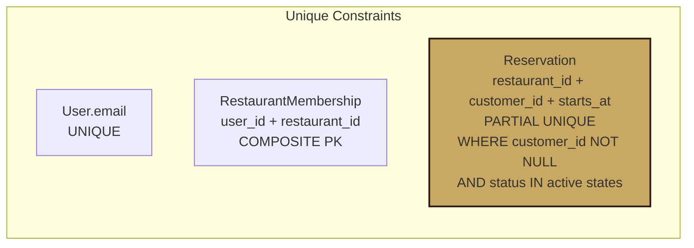
```mermaid
graph LR
    subgraph "Unique Constraints"
        A[User.email<br/>UNIQUE]
        B[RestaurantMembership<br/>user_id + restaurant_id<br/>COMPOSITE PK]
        C[Reservation<br/>restaurant_id + customer_id + starts_at<br/>PARTIAL UNIQUE<br/>WHERE customer_id NOT NULL<br/>AND status IN active states]
    end
    
    style C fill:#c9a961,stroke:#2c1810,stroke-width:2px
```

**Partial Unique Index on Reservation**:
- Prevents customer from having duplicate active reservations at same time
- Only applies when `customer_id IS NOT NULL`
- Only applies to active statuses: `('confirmed', 'checked_in', 'seated')`
- Cancelled and no-show reservations don't count

---

## 7. Role Permission Matrix

### Detailed Authorization Map

```mermaid
graph TB
    subgraph "Role Hierarchy"
        Manager[Manager<br/>Full Access]
        Host[Host<br/>Seating Operations]
        FloorStaff[Floor Staff<br/>Table Status]
        Customer[Customer<br/>Self Service]
        
        Manager -.->|includes| Host
        Host -.->|includes some of| FloorStaff
    end
    
    subgraph "Table Operations"
        T1[List Tables]
        T2[Create Table]
        T3[Update Status]
        
        Manager --> T1
        Manager --> T2
        Manager --> T3
        Host --> T1
        Host --> T3
        FloorStaff --> T1
        FloorStaff --> T3
        Customer --> T1
    end
    
    subgraph "Reservation Operations"
        R1[List All]
        R2[List Own]
        R3[Create]
        R4[Seat]
        R5[Check-In Own]
        R6[Cancel Own]
        R7[Mark No-Show]
        
        Manager --> R1
        Manager --> R3
        Manager --> R4
        Manager --> R7
        Host --> R1
        Host --> R3
        Host --> R4
        Host --> R7
        FloorStaff --> R1
        Customer --> R2
        Customer --> R3
        Customer --> R5
        Customer --> R6
    end
    
    subgraph "Waitlist Operations"
        W1[List Queue]
        W2[Add Entry]
        W3[Update Status]
        W4[Seat Party]
        
        Manager --> W1
        Manager --> W2
        Manager --> W3
        Manager --> W4
        Host --> W1
        Host --> W2
        Host --> W3
        Host --> W4
        FloorStaff --> W1
        Customer --> W1
        Customer --> W2
        Customer --> W3
    end
    
    style Manager fill:#5c1f2a,stroke:#2c1810,stroke-width:3px
    style Host fill:#4fb3a1,stroke:#2c1810,stroke-width:2px
    style FloorStaff fill:#c9a961,stroke:#2c1810,stroke-width:2px
    style Customer fill:#3d2415,stroke:#2c1810,stroke-width:2px
```

### Permission Decision Tree

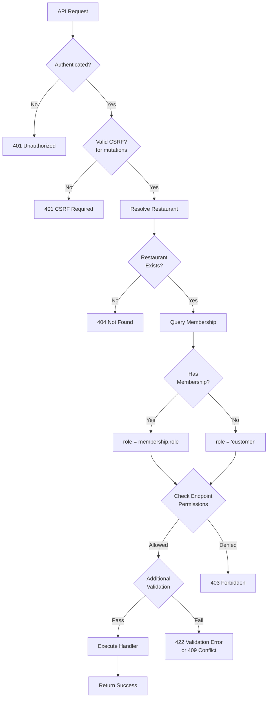
```mermaid
graph TD
    A[API Request] --> B{Authenticated?}
    B -->|No| C[401 Unauthorized]
    B -->|Yes| D{Valid CSRF?<br/>for mutations}
    D -->|No| E[401 CSRF Required]
    D -->|Yes| F[Resolve Restaurant]
    F --> G{Restaurant<br/>Exists?}
    G -->|No| H[404 Not Found]
    G -->|Yes| I[Query Membership]
    I --> J{Has<br/>Membership?}
    J -->|Yes| K[role = membership.role]
    J -->|No| L[role = 'customer']
    K --> M{Check Endpoint<br/>Permissions}
    L --> M
    M -->|Allowed| N{Additional<br/>Validation}
    M -->|Denied| O[403 Forbidden]
    N -->|Pass| P[Execute Handler]
    N -->|Fail| Q[422 Validation Error<br/>or 409 Conflict]
    P --> R[Return Success]
```

---

## 8. State Transition Diagrams

### Table Status Lifecycle

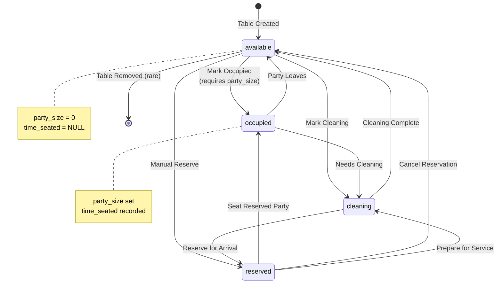
```mermaid
stateDiagram-v2
    [*] --> available: Table Created
    
    available --> occupied: Mark Occupied<br/>(requires party_size)
    available --> reserved: Manual Reserve
    available --> cleaning: Mark Cleaning
    
    occupied --> available: Party Leaves
    occupied --> cleaning: Needs Cleaning
    
    reserved --> occupied: Seat Reserved Party
    reserved --> available: Cancel Reservation
    reserved --> cleaning: Prepare for Service
    
    cleaning --> available: Cleaning Complete
    cleaning --> reserved: Reserve for Arrival
    
    available --> [*]: Table Removed (rare)
    
    note right of occupied
        party_size set
        time_seated recorded
    end note
    
    note right of available
        party_size = 0
        time_seated = NULL
    end note
```

### Reservation Status Lifecycle

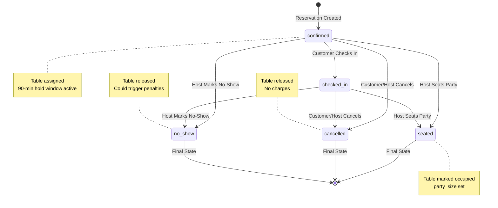
```mermaid
stateDiagram-v2
    [*] --> confirmed: Reservation Created
    
    confirmed --> checked_in: Customer Checks In
    confirmed --> seated: Host Seats Party
    confirmed --> cancelled: Customer/Host Cancels
    confirmed --> no_show: Host Marks No-Show
    
    checked_in --> seated: Host Seats Party
    checked_in --> cancelled: Customer/Host Cancels
    checked_in --> no_show: Host Marks No-Show
    
    seated --> [*]: Final State
    cancelled --> [*]: Final State
    no_show --> [*]: Final State
    
    note right of confirmed
        Table assigned
        90-min hold window active
    end note
    
    note right of seated
        Table marked occupied
        party_size set
    end note
    
    note left of cancelled
        Table released
        No charges
    end note
    
    note left of no_show
        Table released
        Could trigger penalties
    end note
```

### Waitlist Entry Status Lifecycle

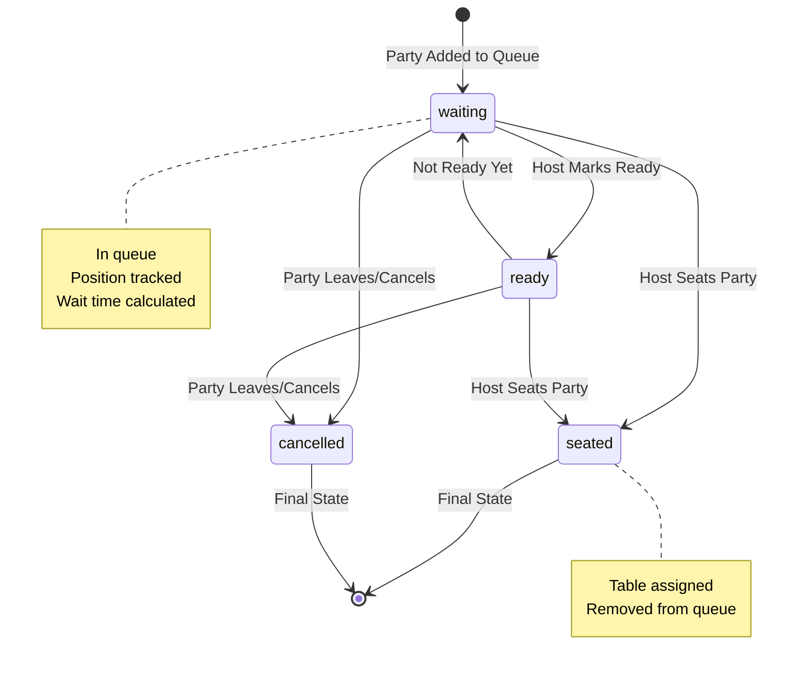
```mermaid
stateDiagram-v2
    [*] --> waiting: Party Added to Queue
    
    waiting --> ready: Host Marks Ready
    waiting --> seated: Host Seats Party
    waiting --> cancelled: Party Leaves/Cancels
    
    ready --> seated: Host Seats Party
    ready --> cancelled: Party Leaves/Cancels
    ready --> waiting: Not Ready Yet
    
    seated --> [*]: Final State
    cancelled --> [*]: Final State
    
    note right of waiting
        In queue
        Position tracked
        Wait time calculated
    end note
    
    note right of seated
        Table assigned
        Removed from queue
    end note
```

---

## 9. Deployment Architecture

### Development Environment

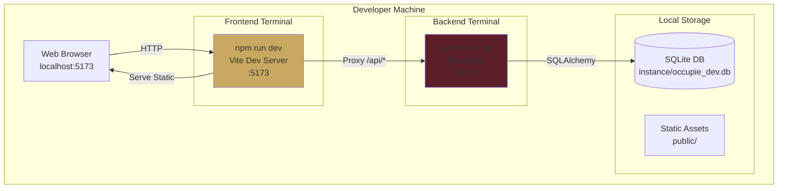
```mermaid
graph TB
    subgraph "Developer Machine"
        subgraph "Frontend Terminal"
            FE[npm run dev<br/>Vite Dev Server<br/>:5173]
        end
        
        subgraph "Backend Terminal"
            BE[python run.py<br/>Flask App<br/>:5000]
        end
        
        subgraph "Local Storage"
            DB[(SQLite DB<br/>instance/occupie_dev.db)]
            Files[Static Assets<br/>public/]
        end
        
        Browser[Web Browser<br/>localhost:5173]
    end
    
    Browser -->|HTTP| FE
    FE -->|Proxy /api/*| BE
    FE -->|Serve Static| Browser
    BE -->|SQLAlchemy| DB
    
    style FE fill:#c9a961
    style BE fill:#5c1f2a
```

### Production Architecture

```mermaid
graph TB
    subgraph "Client"
        Browser[Web Browsers<br/>HTTPS]
    end
    
    subgraph "CDN / Static Hosting"
        CDN[CDN<br/>Cloudflare / S3 + CloudFront]
        Static[Static Assets<br/>dist/]
    end
    
    subgraph "Application Server"
        LB[Load Balancer<br/>HTTPS Termination]
        
        subgraph "Flask Instances"
            API1[Waitress + Flask<br/>Instance 1]
            API2[Waitress + Flask<br/>Instance 2]
            API3[Waitress + Flask<br/>Instance N]
        end
    end
    
    subgraph "Data Layer"
        PG[(PostgreSQL<br/>Primary)]
        PGR[(PostgreSQL<br/>Read Replica)]
        Redis[(Redis<br/>Rate Limits)]
    end
    
    subgraph "Monitoring"
        Logs[Centralized Logs]
        Metrics[Metrics/APM]
    end
    
    Browser -->|HTTPS| CDN
    CDN -->|Cache Miss| LB
    Browser -->|API Requests| LB
    
    LB --> API1
    LB --> API2
    LB --> API3
    
    API1 --> PG
    API2 --> PG
    API3 --> PG
    
    API1 --> Redis
    API2 --> Redis
    API3 --> Redis
    
    PG -.->|Replication| PGR
    
    API1 -.-> Logs
    API2 -.-> Logs
    API3 -.-> Logs
    
    API1 -.-> Metrics
    
    style Browser fill:#3d2415
    style LB fill:#c9a961
    style API1 fill:#5c1f2a
    style API2 fill:#5c1f2a
    style API3 fill:#5c1f2a
    style PG fill:#4fb3a1
```

### Security Layers

```mermaid
graph LR
    subgraph "Client Security"
        HTTPS[HTTPS<br/>TLS 1.3]
        CSP[Content Security Policy]
        SameSite[SameSite Cookies]
    end
    
    subgraph "Application Security"
        CORS[CORS Policy<br/>Explicit Origins]
        JWT[JWT Cookies<br/>HTTP-Only]
        CSRF[CSRF Tokens]
        RateLimit[Rate Limiting<br/>Redis-Backed]
    end
    
    subgraph "Data Security"
        Scrypt[Scrypt Password Hash]
        Encryption[Database Encryption at Rest]
        Backup[Encrypted Backups]
    end
    
    subgraph "Network Security"
        Firewall[Firewall Rules]
        VPC[Private VPC]
        SecGroup[Security Groups]
    end
    
    HTTPS --> CORS
    CORS --> JWT
    JWT --> CSRF
    CSRF --> RateLimit
    RateLimit --> Scrypt
    
    style JWT fill:#5c1f2a,stroke:#2c1810,stroke-width:2px
    style CSRF fill:#c9a961,stroke:#2c1810,stroke-width:2px
    style Scrypt fill:#4fb3a1,stroke:#2c1810,stroke-width:2px
```

---

## Summary

This architecture document provides comprehensive diagrams and sequences for:

1. ✅ **System Architecture**: High-level overview and technology stack
2. ✅ **Request Flow**: Complete frontend-to-backend lifecycle with error handling
3. ✅ **Authentication**: Registration, login, session restoration, logout sequences
4. ✅ **Customer Workflows**: Booking and check-in with database interactions
5. ✅ **Host Workflows**: Waitlist management and seating operations
6. ✅ **Database Schema**: Complete ERD with relationships and constraints
7. ✅ **Authorization**: Role permission matrix and decision trees
8. ✅ **State Machines**: Table, reservation, and waitlist lifecycle diagrams
9. ✅ **Deployment**: Development and production architecture patterns

All diagrams reflect the **actual implemented system** as verified in the codebase.

---

**Related Documentation:**
- [Complete Project Report](./OCCUPIE_COMPLETE_PROJECT_REPORT.md)
- [API Reference](./API_REFERENCE.md)
- [Database Schema](./DATABASE_SCHEMA.md)
- [Setup Guide](./SETUP_AND_TROUBLESHOOTING.md)
